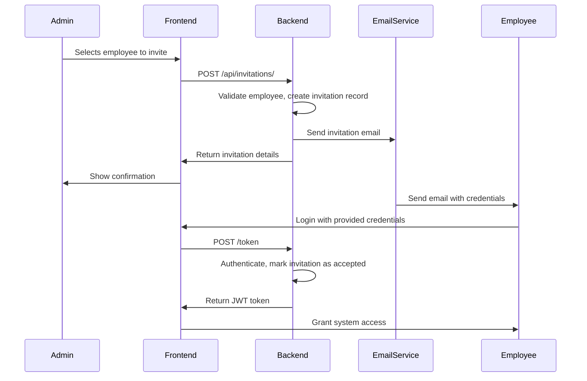

# Employee Invitation System Architecture

## Overview
This document outlines the architecture for implementing an employee invitation feature in AlphaHR that allows administrators to invite existing employees to become system users with login credentials.

## Current System Analysis

### Existing Models
- **User Model**: Handles authentication and system access
- **Employee Model**: Contains detailed employee information
- **Role/Permission System**: RBAC implementation already in place
- **Authentication**: JWT-based with bcrypt password hashing

### Current Authentication Flow
1. Users login via `/token` endpoint with username/password
2. JWT token returned for subsequent API calls
3. Role-based permissions enforced through middleware

## Proposed Invitation System Design

### Database Schema Changes

#### New Model: UserInvitation
```python
class UserInvitation(Base):
    __tablename__ = "user_invitations"
    
    invitation_id = Column(Integer, primary_key=True, index=True)
    employee_id = Column(Integer, ForeignKey("employees.employee_id"), nullable=False)
    user_id = Column(Integer, ForeignKey("users.user_id"), nullable=True)  # Populated after acceptance
    invited_by_user_id = Column(Integer, ForeignKey("users.user_id"), nullable=False)
    invitation_token = Column(String(255), unique=True, nullable=False)
    username = Column(String(50), unique=True, nullable=False)
    password_hash = Column(String(255), nullable=False)
    role_id = Column(Integer, ForeignKey("roles.role_id"), nullable=False)
    
    status = Column(String(20), default="pending")  # pending, accepted, expired, revoked
    invited_at = Column(TIMESTAMP, server_default=func.now())
    expires_at = Column(TIMESTAMP, nullable=False)
    accepted_at = Column(TIMESTAMP, nullable=True)
    
    # Relationships
    employee = relationship("Employee", back_populates="invitation")
    user = relationship("User", foreign_keys=[user_id])
    invited_by = relationship("User", foreign_keys=[invited_by_user_id])
    role = relationship("Role")
```

#### Updated Employee Model
```python
# Add to existing Employee model
invitation = relationship("UserInvitation", back_populates="employee", uselist=False)
user_account = relationship("User", foreign_keys="User.employee_id", back_populates="employee_profile")
```

#### Updated User Model
```python
# Add to existing User model
employee_id = Column(Integer, ForeignKey("employees.employee_id"), nullable=True)
employee_profile = relationship("Employee", back_populates="user_account", foreign_keys=[employee_id])
```

### Backend API Endpoints

#### Invitation Management Endpoints
```
POST   /api/invitations/              # Create new invitation
GET    /api/invitations/              # List all invitations (admin)
GET    /api/invitations/{id}          # Get invitation details
PUT    /api/invitations/{id}/resend   # Resend invitation
DELETE /api/invitations/{id}          # Revoke invitation
POST   /api/invitations/accept/{token} # Accept invitation
GET    /api/invitations/by-employee/{employee_id} # Get invitation status for employee
```

#### Employee Integration
```
GET    /api/employees/invitable       # List employees without user accounts
POST   /api/employees/{id}/invite     # Invite specific employee
```

### Email Service Implementation

#### Email Configuration
```python
# backend/config.py additions
SMTP_HOST = os.getenv("SMTP_HOST")
SMTP_PORT = int(os.getenv("SMTP_PORT", 587))
SMTP_USERNAME = os.getenv("SMTP_USERNAME")
SMTP_PASSWORD = os.getenv("SMTP_PASSWORD")
EMAIL_FROM = os.getenv("EMAIL_FROM")
EMAIL_TEMPLATE_DIR = "templates/email/"
```

#### Email Service
```python
# backend/services/email_service.py
class EmailService:
    def send_invitation_email(self, employee_email: str, invitation_details: dict):
        # Send email with login credentials
        
    def send_welcome_email(self, user_email: str, login_details: dict):
        # Send welcome email after account creation
```

### Frontend Components

#### Employee List Enhancements
- Add "Invite" button for employees without user accounts
- Show invitation status in employee table
- Filter for "invitable" employees

#### Invitation Dialog Component
```typescript
interface InvitationForm {
  employeeId: number
  username: string
  password: string
  confirmPassword: string
  roleId: number
  sendEmail: boolean
}
```

#### Invitation Management Page
- List all invitations with status
- Resend/revoke functionality
- Invitation history tracking

### Workflow Process



### Security Considerations

#### Invitation Security
- Unique invitation tokens with expiration
- Password complexity requirements
- Rate limiting on invitation creation
- Admin-only invitation permissions

#### Email Security
- Secure SMTP configuration
- Email content sanitization
- Optional email sending (for development/testing)

### Permission Matrix

| Role | Create Invitation | View Invitations | Manage Invitations |
|------|------------------|------------------|-------------------|
| Admin | ✅ | ✅ | ✅ |
| Manager | ✅ (dept limited) | ✅ (dept limited) | ✅ (dept limited) |
| HR | ✅ | ✅ | ✅ |
| Employee | ❌ | ❌ | ❌ |

### Error Handling

#### Validation Errors
- Employee already has user account
- Username already exists
- Invalid email format
- Role assignment permissions

#### System Errors
- Email service unavailable
- Database constraint violations
- Network timeouts

### Implementation Phases

#### Phase 1: Core Infrastructure
1. Database schema updates
2. Basic invitation API endpoints
3. Email service foundation

#### Phase 2: Frontend Integration
1. Employee list enhancements
2. Invitation dialog component
3. Basic invitation management

#### Phase 3: Advanced Features
1. Invitation status tracking
2. Resend/revoke functionality
3. Permission-based access controls

#### Phase 4: Testing & Documentation
1. Comprehensive testing
2. User documentation
3. Admin guide

### Technical Dependencies

#### Backend Requirements
- Email service library (smtplib or third-party)
- Additional validation schemas
- Database migration scripts

#### Frontend Requirements
- New API service methods
- Form validation components
- Status indicators

### Monitoring & Logging

#### Invitation Metrics
- Invitation creation rate
- Acceptance rate
- Time to acceptance
- Failed invitations

#### Audit Trail
- Who invited whom
- When invitations were sent
- Invitation status changes
- Permission changes

## Next Steps

1. Implement database schema changes
2. Create core invitation service
3. Build email notification system
4. Develop frontend interface
5. Add comprehensive testing
6. Deploy with feature flags
7. Monitor and iterate based on usage

This architecture provides a secure, scalable invitation system that integrates seamlessly with the existing AlphaHR authentication and authorization framework.